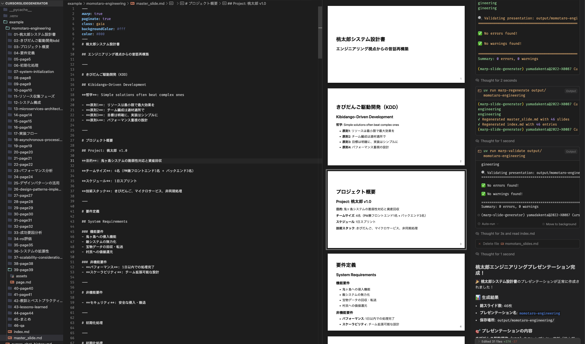

# Marp Slide Generator

A smart slide generator for creating well-organized Marp presentations. Automatically splits content into properly sized slides with intelligent break points.




## Quick Start in Cursor

### Generate slides from chat content

Paste your content directly in Cursor chat and use:

```bash
# Method 1: Using echo
echo "YOUR SLIDE CONTENT HERE" | uv run marp-quick

# Method 2: Using heredoc (recommended for longer content)
uv run marp-quick << 'EOF'
# Your Title

Your slide content here...

---

# Another slide
More content...
EOF

# Method 3: With custom name
uv run marp-quick -n "my-presentation" << 'EOF'
# Content here
EOF
```

### Generate from a file

```bash
uv run marp-gen -i input.txt -o output -n my-presentation -t gaia
```

### Watch mode (auto-regenerate on file changes)

```bash
uv run marp-watch -i input.txt -o output -n my-presentation
```

### Regenerate master/index after manual edits

```bash
uv run marp-regenerate output/my-presentation
```

### Validate slide quality

```bash
# Check for common issues
uv run marp-validate output/my-presentation

# Strict mode (warnings also fail)
uv run marp-validate output/my-presentation --strict
```

## Output Structure

```
output/
└── presentation-name/
    ├── master_slide.md      # Master file with all slides
    ├── index.md             # Index of all slides
    ├── 01-title/
    │   ├── page.md          # Individual slide content
    │   └── assets/          # Images for this slide
    ├── 02-introduction/
    │   ├── page.md
    │   └── assets/
    └── ...
```

## Features

### Smart Content Processing
- **Intelligent splitting**: Automatically divides content at logical break points
- **Multi-language support**: Handles mixed Japanese/English content (as shown in momotaro example)
- **Code block preservation**: Maintains formatting for JavaScript, Python, YAML examples
- **Table handling**: Preserves complex tables and diagrams
- **Page limits**: Keeps slides readable (under 15 lines)

### Professional Organization
- **Sequential numbering**: `01-title`, `02-content`, etc.
- **Title-based folders**: Derived from slide headers
- **Asset management**: Each slide has dedicated assets folder
- **Master compilation**: Single file with all slides for export
- **Index generation**: Complete slide overview with titles

### Development Workflow
- **Live editing**: Watch mode for automatic regeneration
- **Quality validation**: Built-in checks for common issues
- **Flexible input**: From files, stdin, chat, or direct text
- **Multiple themes**: Professional styling options

## Validation Features

The validator checks for:
- **Structure**: Missing files, incorrect folder naming, non-sequential numbering
- **Code blocks**: Unclosed code blocks (critical for presentations with code)
- **Mermaid diagrams**: Syntax validation for technical diagrams
- **Content quality**: Slide length warnings, readability checks
- **Consistency**: Matching slide counts across master/index files
- **Assets**: Missing or unused images

### Example Validation Output
```bash
$ uv run marp-validate example/momotaro-engineering
✅ All validation checks passed
📊 Presentation: 46 slides, 0 warnings, 0 errors
🎯 Quality Score: 100%
```

## Editing Workflow

### Critical Rules
1. **Never edit master_slide.md directly** - Always edit individual page.md files
2. **Non-sequential numbering is an ERROR** - Always maintain proper sequence
3. **Always validate after changes** - Run `marp-validate` to catch issues

### Common Operations
- **Split a slide**: Create new folders, move content, update numbering
- **Reorder slides**: Rename folders (keep NN- prefix), run regenerate
- **Add content**: Edit page.md files individually
- **After manual edits**: Always run `marp-regenerate` then `marp-validate`

### Example: Fixing Validation Errors
```bash
# Step 1: Identify issues
uv run marp-validate output/presentation-name

# Step 2: Fix individual slides
# (Edit page.md files to fix unclosed code blocks, missing headers, etc.)

# Step 3: Fix numbering if needed
# Rename folders: 01-title, 02-content, 03-conclusion

# Step 4: Regenerate and validate
uv run marp-regenerate output/presentation-name
uv run marp-validate output/presentation-name
```

## Themes

- `default` - Clean, professional (good for business presentations)
- `gaia` - Bold, high-contrast (used in momotaro example)
- `uncover` - Minimalist design (good for technical content)


## Tips

- Use `#` for slide titles, `##` for subtitles
- Use `---` for explicit page breaks
- Keep content concise - aim for bullet points
- Place images in the slide's `assets/` folder
- Run validation after editing to catch issues early

## Installation

```bash
# Clone the repository
git clone <repo-url>
cd CursorSlideGenerator

# Install dependencies
uv sync
```

## License

MIT 